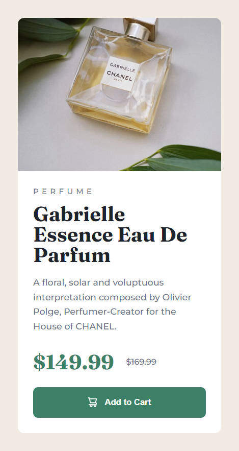
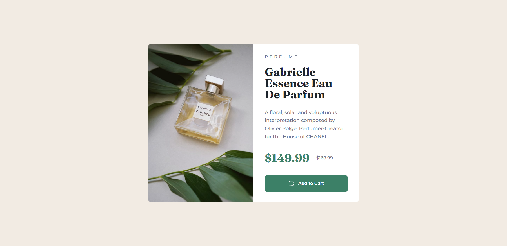

# Frontend Mentor - Product preview card component solution

This is a solution to the [Product preview card component challenge on Frontend Mentor](https://www.frontendmentor.io/challenges/product-preview-card-component-GO7UmttRfa). Frontend Mentor challenges help you improve your coding skills by building realistic projects.

## Table of contents

- [Frontend Mentor - Product preview card component solution](#frontend-mentor---product-preview-card-component-solution)
  - [Table of contents](#table-of-contents)
  - [Overview](#overview)
    - [Screenshot](#screenshot)
    - [Links](#links)
  - [My process](#my-process)
    - [Built with](#built-with)
    - [What I learned](#what-i-learned)
    - [Continued development](#continued-development)
    - [Useful resources](#useful-resources)
  - [Author](#author)
  - [Acknowledgments](#acknowledgments)

## Overview

This is my solution to the Product preview card component challenge. It is a simple card
that shows the image of the product and a description with the price and a
button to add to cart.

### Screenshot




### Links

- Solution URL: [GitHub](https://github.com/newbpydev/product-preview-card-component)
- Live Site URL: [Live Site](https://thunderous-pony-ec9a45.netlify.app)

## My process

### Built with

- Semantic HTML5 markup
- CSS custom properties
- Flexbox
- Svelte + Vite

### What I learned

I have learned on this project that we need to practice everyday and work hard
to really understand how everything works, specially with the images background.
I will have to review this topic better.

```css
.product-card__button {
  width: 100%;
  height: 4.8rem;
  border: none;
  border-radius: 0.8rem;
  background: var(--pri-cyan);
  color: var(--neut-white);
  display: flex;
  justify-content: center;
  align-items: center;
  gap: 1.161rem;
  transition: all 0.3s ease;
}
```

### Continued development

For future development, I will continue to use background-image for divs so I
could practice more the placement of the image in the element.

### Useful resources

- [CSS-TRICKS - Centering CSS Complete Guide](https://css-tricks.com/centering-css-complete-guide/) - If you have two or more block-level elements that need to be centered horizontally in a row, chances are you’d be better served making them a different display type. Here’s an example of making them inline-block and an example of flexbox....
- [MDN - background-image](https://developer.mozilla.org/en-US/docs/Web/CSS/background-image) - The background-image CSS property sets one or more background images on an element.

## Author

- Website - [Juan Gomez](https://www.newbpydev.com)
- Frontend Mentor - [@newbpydev](https://www.frontendmentor.io/profile/newbpydev)
- Twitter - [@Newb_PyDev](https://twitter.com/Newb_PyDev)

## Acknowledgments

The code may not be perfect compared to my sensei @jonasschmedtman but I need
to thank him because he has shown me the ropes and now I am a confident web
designer.
